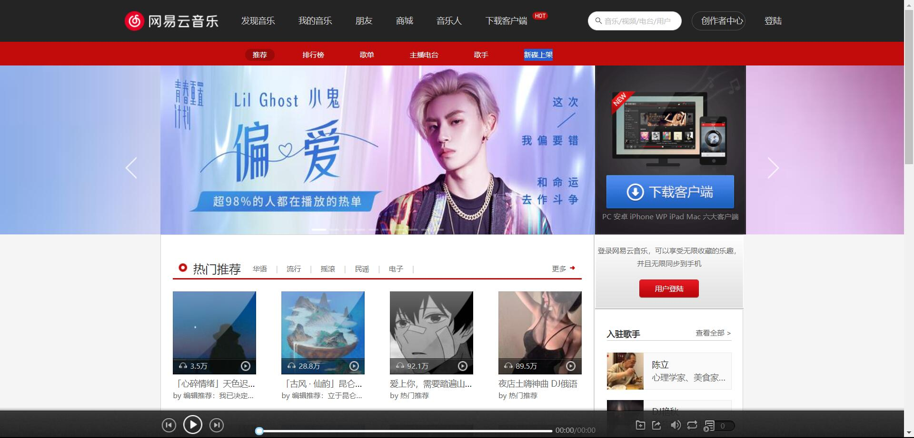
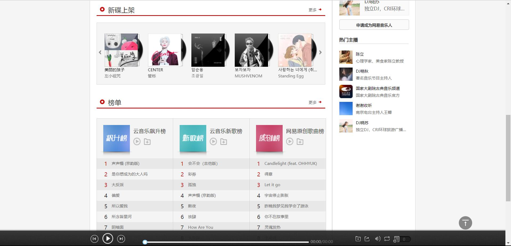
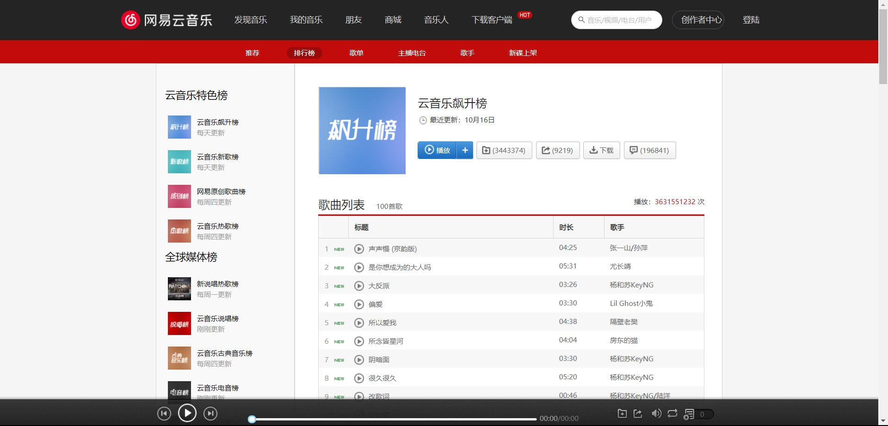
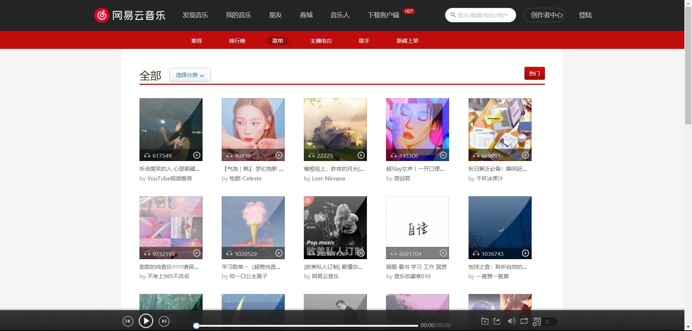
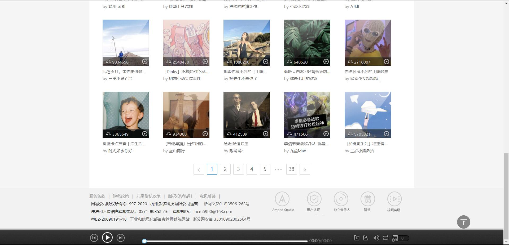
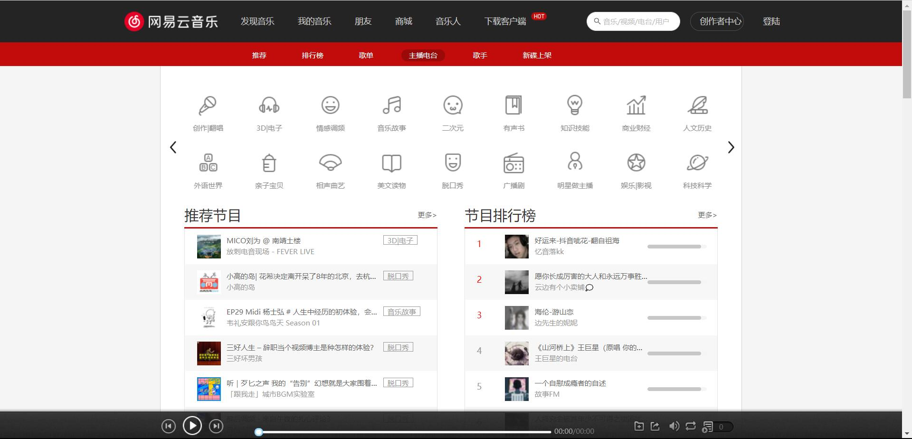
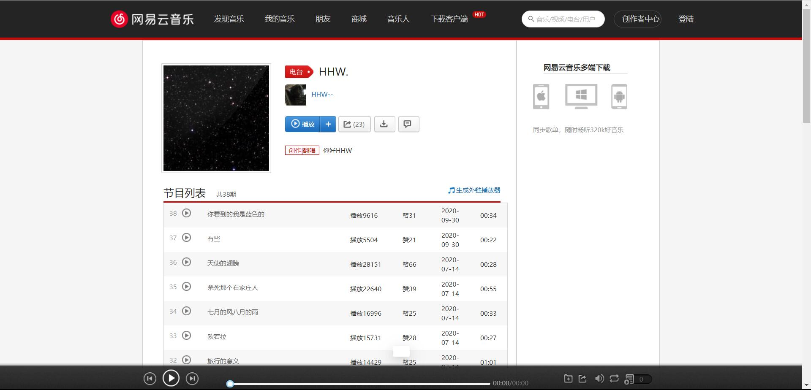
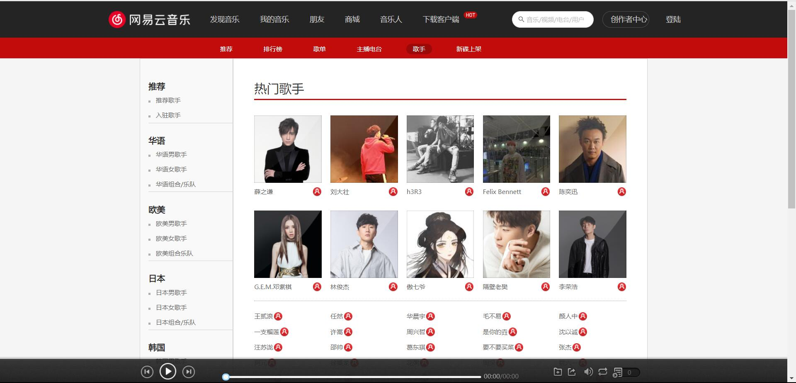
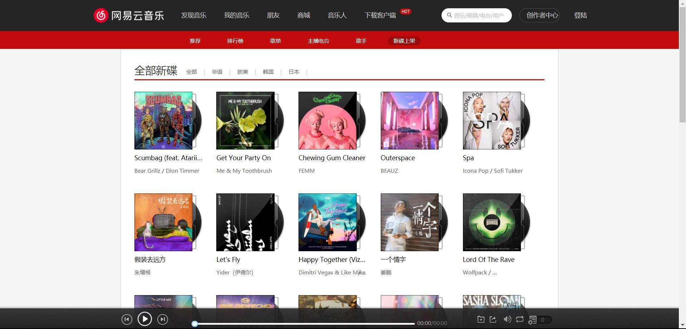
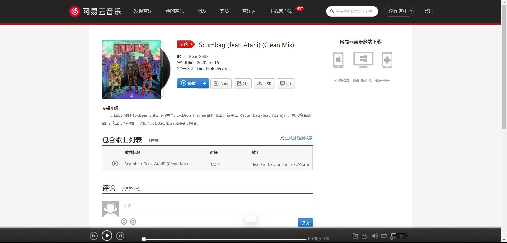

# 网易云音乐

使用 React 编写的云音乐 PC Web 项目，接口来源于开源的接口。

## 介绍

本项目为高仿网易云音乐项目，接口来源于开源的接口，具有推荐、排行榜、主播电台、歌手、 新碟上架等二十多个页面

- 推荐页面：轮播图、热门推荐、新碟上架、榜单 等功能。




- 排行榜页面：各种榜单的切换。



- 歌单页面：选择分类、选择分类后根据分类切换歌单、根据分类，歌单列表的展示、分页功能。




- 主播电台：电台分类的展示、滚动、不同分类展示不同的数据、电台排行榜展示、分页。




- 歌手页面：各种歌手分类（没找到接口，还自定义了一些数据）、歌手字母分类、对应歌手展示。



- 新碟上架页面：热门新碟、全部新碟、分页展示。




## 运行项目

- 安装依赖: `npm install`
- 启动项目: `npm run start`
- 编译项目: `npm run build`

## 技术难点

### 请求网络后访问数据出错

- 难点详细：使用 axios 请求数据后无法立即访问数据，原因是请求数据是异步操作
- 难点解决：使用 `const 数据 = 请求数据.键 || {};` 或 `数据.键 && 数据.键[值];` 进行访问数据

### 精灵图偏移后依然需要偏移

- 难点详细：显示偏移后的精灵图后，增加 hover 效果需要在当前显示的偏移后精灵图再次进行偏移

- 难点解决：
  使用一个标签进行占位，然后使用 margin 属性对标签进行偏移，使标签覆盖原精灵图，最后对此标签设置精灵图及 hover 效果

### 路由标签跳转

### 动态显示 Redux 状态

- 难点详细：判断 `Redux DevTools` 扩展是否安装，如果已安装则注册 `Redux DevTools`，如果没有安装则不注册 `Redux DevTools`
- 难点解决：

```JavaScript
let store;
if (
  process.env.NODE_ENV === "development" &&
  (window.__REDUX_DEVTOOLS_EXTENSION__ || window.__REDUX_DEVTOOLS_EXTENSION__)
) {
  // 开发环境且已安装 Redux-Devtools 插件
  const composeEnhancers = window.__REDUX_DEVTOOLS_EXTENSION_COMPOSE__({ trace: true }) || compose;
  store = createStore(reducer, composeEnhancers(applyMiddleware(thunk)));
} else {
  // 生产环境
  store = createStore(reducer, applyMiddleware(thunk));
}
```

### JavaScript 中\n 转`<br>`

- 难点详细：
  axios 请求的数据中，包含有 \n 的字符串，展示则需要将 `\n` 转换为`<br />`

- 难点解决：使用`split`方法对字符串分割，分隔符使用`\n`，对分割后的每一个元素增加 `<br />`
